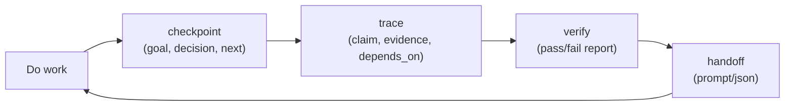

# CortexLog
[](https://github.com/nishchay7pixels/CortexLog/actions/workflows/ci.yml)

CortexLog is a local CLI that gives humans and AI agents a shared memory timeline.

It stores work events in an append-only JSONL file so sessions can be resumed safely after context loss, handoffs, or restarts.

## What this repo does

CortexLog helps you answer 3 questions quickly:

- What are we trying to do right now?
- What changed, and why?
- Is our current claim consistent with evidence?

It combines:

- `checkpoint`: goal + decision + next actions
- `trace` (TruthGraph): claim + outcome + evidence + dependencies
- `verify`: contradiction and dependency checks
- `handoff`: machine-readable transfer packet for next human/agent

## Why it is useful for humans too

- Better project memory across days
- Easier review of decision history
- Faster onboarding for a new teammate
- Safer releases with explicit verification gates

## Mental model



## 5-minute quick start

```bash
# 1) Capture current state
python3 cortexlog.py checkpoint \
  --goal "Ship migration safely" \
  --decision "Use additive schema change first" \
  --next "Write migration test" \
  --next "Run canary deploy" \
  --files "db/migrations/001.sql,tests/test_migration.py" \
  --tags "backend,release"

# 2) Record a verifiable claim
python3 cortexlog.py trace \
  --claim "Migration tests pass in CI" \
  --outcome confirmed \
  --evidence "python3 -m unittest discover -s tests -q,gh run view 123"

# 3) Run integrity check (exit code 0 on pass, 1 on fail)
python3 cortexlog.py verify

# 4) Generate handoff for next person/agent
python3 cortexlog.py handoff --verified --format json
```

## Example flows

### Flow 1: Normal feature loop

```bash
python3 cortexlog.py checkpoint --goal "Add CSV export" --decision "Use streaming writer" --next "Implement endpoint" --next "Add tests"
python3 cortexlog.py add "Implemented endpoint skeleton" --tags backend
python3 cortexlog.py trace --claim "CSV endpoint returns valid header" --outcome confirmed --evidence "pytest tests/test_csv.py"
python3 cortexlog.py resolve "Implement endpoint"
python3 cortexlog.py handoff --verified --format prompt
```

### Flow 2: Detect contradiction before merge

```bash
python3 cortexlog.py trace --claim "All tests pass" --outcome confirmed --evidence "pytest -q"
python3 cortexlog.py trace --claim "All tests pass" --outcome failed --evidence "CI run #142"
python3 cortexlog.py verify
# returns FAIL and exit code 1
```

### Flow 3: Agent handoff after context reset

```bash
python3 cortexlog.py list --kind checkpoint
python3 cortexlog.py search "rate limiter"
python3 cortexlog.py handoff --verified --format json > handoff.json
```

## What "verify" checks

`verify` runs TruthGraph checks on `trace` events:

- Contradictions: same normalized claim marked both `confirmed` and `failed`
- Dangling dependencies: `depends_on` references unknown trace IDs
- Unresolved failed claims: latest state of a claim is still `failed`
- Warning only: `confirmed` claims without evidence

## Command reference

- `add "note" [--tags comma,separated]`
- `checkpoint --goal "..." --decision "..." --next "..." [--next "..."] [--files a,b] [--tags a,b] [--note "..."]`
- `trace --claim "..." --outcome pending|confirmed|failed|retracted [--evidence a,b] [--depends-on t1,t2] [--id t9] [--tags a,b] [--note "..."]`
- `verify [--format prompt|json]`
- `resolve "task text" [--note "..."] [--tags a,b]`
- `list [--day YYYY-MM-DD] [--kind note|checkpoint|trace|resolve]`
- `search "query" [--kind note|checkpoint|trace|resolve]`
- `stats`
- `handoff [--limit N] [--format prompt|json] [--verified]`

## Data model

Each row in `.cortexlog.jsonl` is immutable:

- `note`: free-form observation
- `checkpoint`: objective + decision + next actions + touched files
- `trace`: causal claim + outcome + evidence + dependencies
- `resolve`: closure of an earlier next-action

Open tasks are computed as: checkpoint actions minus resolved tasks.

## Storage

- Default DB: `.cortexlog.jsonl` in current directory
- Override DB: `--db /path/to/file.jsonl`

## Tests

```bash
python3 -m unittest discover -s tests -q
```

## More docs

- [FAQ](/Users/nishchay/Desktop/Workspace/Codex/docs/faq.md)
- [Recipes](/Users/nishchay/Desktop/Workspace/Codex/docs/recipes.md)

## AI-agent searchable keywords

`cortexlog`, `truthgraph`, `ai agent memory`, `context window recovery`, `agent handoff`, `causal trace graph`, `append-only event log`, `jsonl memory`, `resumable autonomous workflow`, `checkpointed decisions`, `task resolution ledger`, `workspace cognition`
